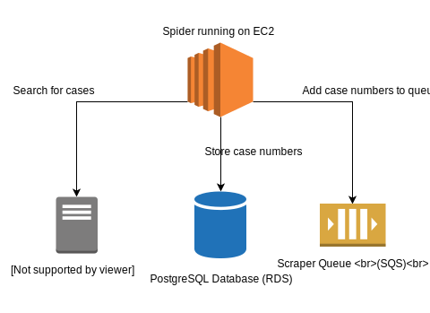
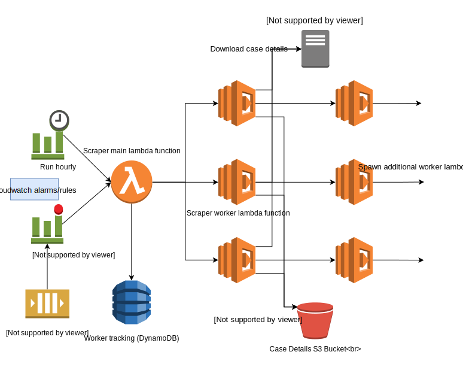
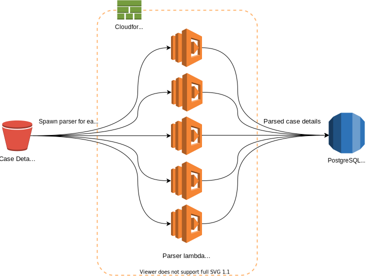

# Case Harvester
Case Harvester is a project designed to mine the [Maryland Judiciary Case Search](https://casesearch.courts.state.md.us/casesearch/inquiry-index.jsp) (MJCS) and build a near-complete database of Maryland court cases that can be queried and analyzed without the limitations of the MJCS interface. It is designed to leverage [Amazon Web Services (AWS)](https://aws.amazon.com/) for scalability and performance.

Our database of cases (with criminal defendant names redacted) is available to the public and can be found at [mdcaseexplorer.com](https://mdcaseexplorer.com), which is built using our [Case Explorer](https://github.com/dismantl/CaseExplorer) software. REST and GraphQL APIs are also available. If you would like to download tables from our database exported monthly, you can find that at [exports.caseharvester.com](https://exports.caseharvester.com/).

> **NOTE: Unless you are modifying Case Harvester for specific purposes, please do not run your own instance so that MJCS is spared unneccesary load. Instead, use the options described above for viewing the data, or if you have an AWS account you are also welcome to clone our database directly.**

# Architecture
Case Harvester is split into three main components: spider, scraper, and parser. Each component is a part of a pipeline that finds, downloads, and parses case data from the MJCS. The following diagram shows at a high level how each of these components interact:


### Spider
The spider component is responsible for discovering new case numbers. It does this by submitting search queries to the MJCS and iterating through the results. Because the MJCS only returns a maximum of 500 results, the search algorithm splits queries that return 500 results into a set of more narrowed queries which are then submitted. Each of these queries is then split again if more than 500 results are returned, and so forth, until the MJCS is exhaustively searched for case numbers. Each discovered case number is submitted to a PostgreSQL database, and then added to a queue for scraping:



The Spider is launched using Elastic Container Service (ECS) Fargate tasks run at [regularly scheduled intervals](#schedule). These tasks run Case Harvester from a Docker image pulled from an Elastic Container Registry (ECR). Periodically the spider will save its state using a combination of DynamoDB and S3, which allows resuming failed or canceled spider runs.

### Scraper
The scraper component downloads and stores the case details for every case number discovered by the spider. The full HTML for each case ([example](https://casesearch.courts.state.md.us/casesearch/inquiryDetail.jis?caseId=116090001&loc=69&detailLoc=DSK8)) is added to an S3 bucket. Version information is kept for each case, including a timestamp of when each version was downloaded, so changes to a case can be recorded and referenced.



The scraper is a continuously running ECS service that processes case numbers from the SQS scraper queue.

### Parser
The parser component is a Lambda function that parses the fields of information in the HTML case details for each case, and stores that data in the PostgreSQL database. Each new item added to the scraper S3 bucket triggers a new parser Lambda invocation, which allows for significant scaling.



Case details in the MJCS are formatted differently depending on the county and type of case (e.g. district vs circuit court, criminal vs civil, etc.), and whether it is in one of the new [MDEC](https://mdcourts.gov/mdec/about)-compatible formats. MJCS [assigns a code to each of these different case types](https://www.muckrock.com/foi/maryland-154/case-search-court-classifications-56516/#comm-564971). While the case details for all discovered cases are stored in S3, Case Harvester only has full parser support for the following types of cases (see [issue #10](https://github.com/dismantl/CaseHarvester/issues/10)):
* ODYCRIM: MDEC Criminal Cases
* ODYTRAF: MDEC Traffic Cases
* ODYCIVIL: MDEC Civil Cases
* ODYCVCIT: MDEC Civil Citations
* CC: Circuit Court Civil Cases
* DSCIVIL: District Court Civil Cases
* DSCR: District Court Criminal Cases
* DSK8: Baltimore City Criminal Cases
* DSTRAF: District Court Traffic Cases
* DSCP: District Court Civil Citations
* K: Circuit Court Criminal Cases
* PG: Prince George's County Circuit Court Criminal Cases
* PGV: Prince George's County Circuit Court Civil Cases
* DV: Domestic Violence Cases
* MCCI: Montgomery County Civil Cases

The following case types are still in need of parsers:
* MCCR: Montgomery County Criminal Cases
* ODYCOA: Court of Appeals
* ODYCOSA: Court of Special Appeals

Each different parser breaks down the case details to a granular level and stores the data in a number of database tables. This [schematic diagram](https://disman.tl/caseharvester/relationships.html) illustrates how this data is represented in the database.

# Schedule
Case Harvester essentially has two main tasks:
1. Discover new case numbers, and
2. Capture updates/changes to case details for known cases.

In order to find new case numbers, Case Harvester uses scheduled tasks to run the spider component according to the following schedule:
- Every day, spider for cases filed within the last month
- Every week, spider for cases filed within the last 6 months
- Every month, spider for cases filed within the last year

The scraper component runs daily to capture any updated case details in MJCS. Case numbers are chosen for rescraping based on the case's age (since filing date), with newer cases being rescraped more frequently than older cases. For example, cases less than 3 months old are rescraped every day while a 4-year-old case will be rescraped every 2 weeks. These settings can be tuned with the `RESCRAPE_COEFFICIENT`, `MAX_SCRAPE_AGE`, and `MAX_SCRAPE_AGE_INACTIVE` configuration variables. When updates to a case are found by the scraper, a new version of the case details HTML is saved in S3 and the database is updated to reflect the most recent case details.

# Installation
Case Harvester can be run or deployed from any workstation running Python 3.8, [GNU Make](https://www.gnu.org/software/make/), and [jq](https://stedolan.github.io/jq/). The required Python modules are in `requirements.txt` and can be installed with `pip3 install -r requirements.txt`. Creating a Python virtual environment is recommended.

Next, configure AWS CLI with `aws configure` so that it can deploy Case Harvester using your account. Here you'll use an Access Key ID and Secret Access Key either for your root AWS account, or an IAM user or role that has sufficient permissions.

## Deploy to AWS
Case Harvester uses [Cloudformation](https://aws.amazon.com/cloudformation/) stacks to deploy, configure, and connect all of the needed AWS resources. There are separate stacks for static resources (VPC, S3 bucket, RDS instance), spider, scraper, and parser. The first step is to set strong, unique passwords for the database users in `secrets.json`:

```
{
  "development":{
    "DatabaseMasterUsername":"root",
    "DatabaseMasterPassword":"badpassword",
    "DatabaseUsername":"db_user",
    "DatabasePassword":"badpassword",
    "DatabaseReadOnlyUsername":"ro_user",
    "DatabaseReadOnlyPassword":"badpassword"
  },
  "production":{
    "DatabaseMasterUsername":"root",
    "DatabaseMasterPassword":"badpassword",
    "DatabaseUsername":"db_user",
    "DatabasePassword":"badpassword",
    "DatabaseReadOnlyUsername":"ro_user",
    "DatabaseReadOnlyPassword":"badpassword"
  }
}
```

You can then deploy the cloudformation stacks to AWS by running:

```
make deploy
```

Once this is finished, you can intialize the database and configure Case Harvester to use the newly deployed resources by running:

```
make init
```

Note that the above commands deploy and initialize a development environment. To deploy to a production environment:

```
make deploy_production
make init_production
```

More make targets (such as deploying a specific stack or generating documentation) can be found by looking in the [`Makefile`](Makefile).

# Usage
You can manually run the spider (or other components) on the command line by specifying a search time range and county:
```
./src/case_harvester.py spider --start-date 1/1/2000 --end-date 12/31/2000 --county 'BALTIMORE CITY'
```

By default, `case_harvester.py` runs in your development AWS environment (see [Deploy to AWS](#deploy-to-aws)). To run in your production environment, add the `--environment production` CLI flag:

```
./src/case_harvester.py spider --environment production -s 1/1/2000 -e 12/31/2000 --county 'BALTIMORE CITY'
```

# Questions
For questions or more information, email [dan@acab.enterprises](mailto:dan@acab.enterprises).
