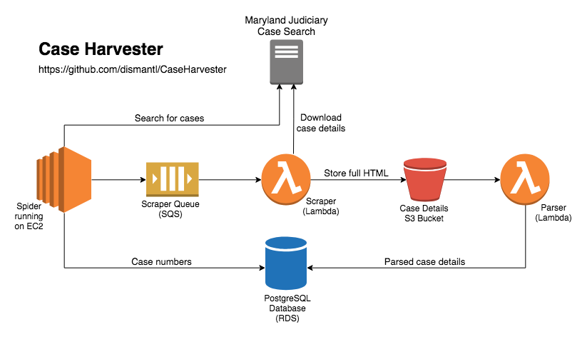
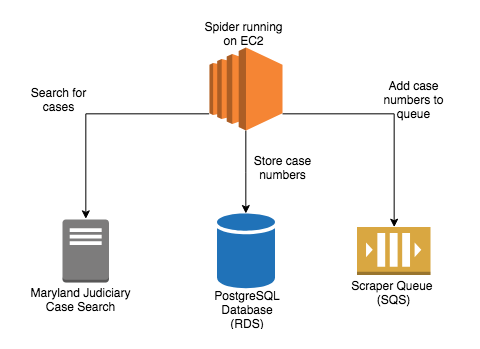
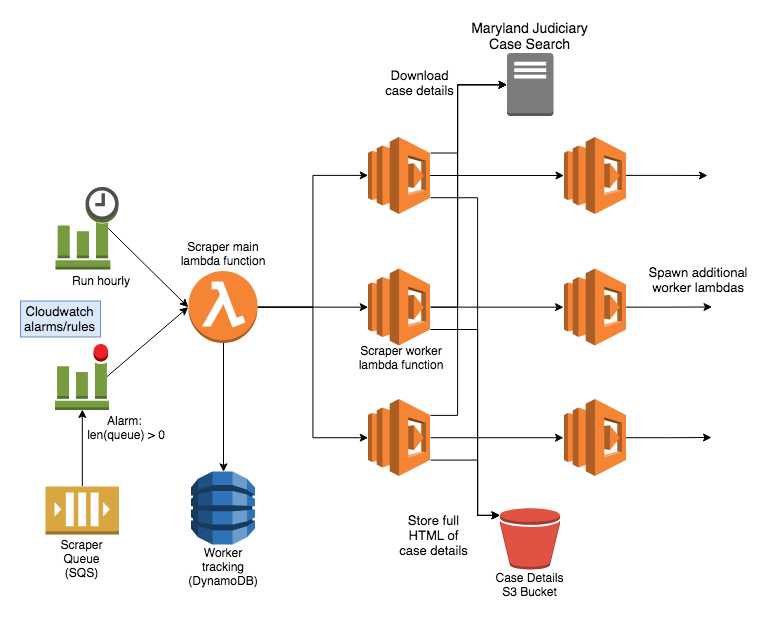
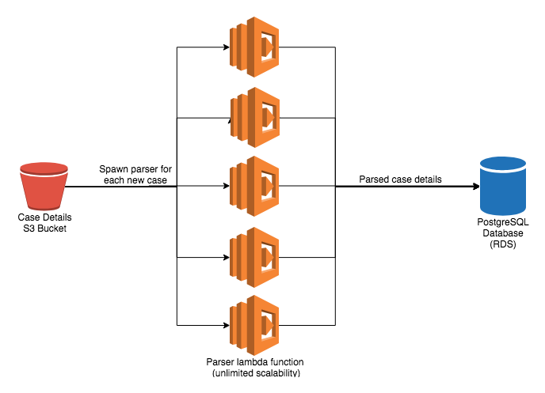

# Case Harvester
Case Harvester is a project designed to mine the [Maryland Judiciary Case Search](http://casesearch.courts.state.md.us/casesearch/inquiry-index.jsp) (MJCS) and build a near-complete database of Maryland court cases that can be queried and analyzed without the limitations of the MJCS interface. It is designed to leverage [Amazon Web Services (AWS)](https://aws.amazon.com/) for scalability and performance.

If you are a researcher or journalist and would like access to our database, please reach out to us at [caseharvester@disman.tl](mailto:caseharvester@disman.tl).

# Overview
## Components
Case Harvester is split into three main components: spider, scraper, and parser. Each component is a part of a pipeline that finds, downloads, and parses case data from the MJCS. The following diagram shows at a high level how each of these components interact:

### Spider
The spider component is responsible for discovering case numbers. It does this by submitting search queries to the MJCS and iterating through the results. Because the MJCS only returns a maximum of 500 results, the search algorithm splits queries that return 500 results into a set of more narrowed queries which are then submitted. Each of these queries is then split again if more than 500 results are returned, and so forth, until the MJCS is exhaustively searched for case numbers. Each discovered case number is submitted to a PostgreSQL database, and then added to a queue for scraping:

The spider can be run from any workstation, though for convenience it is usually run on an EC2 instance since the search process can take a long time.

### Scraper
The scraper component downloads and stores the case details for every case number discovered by the spider. The full HTML for each case ([for example](http://casesearch.courts.state.md.us/casesearch/inquiryDetail.jis?caseId=116090001&loc=69&detailLoc=DSK8)) is added to an S3 bucket. Version information is kept for each case, including a timestamp of when each version was downloaded, so changes to a case can be recorded and referenced.

The scraper is a [Lambda function](https://aws.amazon.com/lambda/) that runs once an hour, as well as when the scraper queue has items in it. When the scraper is initially invoked by one of these triggers, it spawns a limited number of worker functions which can each scrape up to 10 cases from the queue. Each of the worker functions spawns another worker function upon completion, until the scraper queue is empty. The scraper is configured to spawn usually 1-2 concurrent worker functions, in order to limit the load on the MJCS. 

### Parser
The parser component is another Lambda function that parses the case details from the HTML for each case, and stores those in the PostgreSQL database ([see here](https://disman.tl/mjcs/docs/) for database schema information). Each new item added to the scraper S3 bucket spawns a parser function, which allows for significant scaling.

