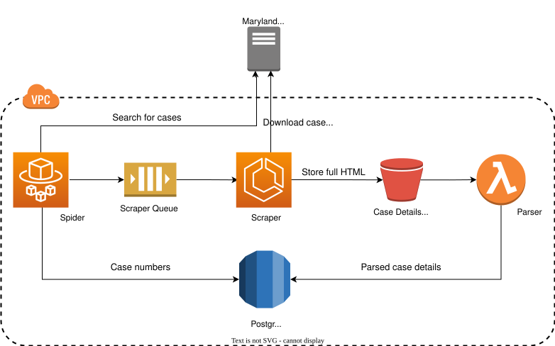

# Case Harvester

> **Case Harvester has relaunched at [caseharvester.org](https://caseharvester.org). The court record, made usable.**

Case Harvester is a project designed to scrape the [Maryland Judiciary Case Search](https://casesearch.courts.state.md.us/casesearch/inquiry-index.jsp) (MJCS) and build a near-complete database of Maryland court cases that can be queried and analyzed without the limitations of the MJCS interface. It is designed to leverage [Amazon Web Services (AWS)](https://aws.amazon.com/) for scalability and performance.

# The relaunch

Case Harvester began as an Open Justice Baltimore project and now runs independently at [caseharvester.org](https://caseharvester.org). The relaunched service is a continuously refreshed database of Maryland court cases, covering courts statewide back to 2000 and Baltimore City back to 1990. Live case counts, coverage by category and filing year, and data freshness are published on the [statistics page](https://caseharvester.org/stats), along with the SQL behind every figure.

Licensed access includes a REST API, exact case lookup, CSV export, and an MCP server so AI agents can query the database directly. The personal details of criminal defendants and eviction tenants are withheld. Access can be requested at [caseharvester.org/request-access](https://caseharvester.org/request-access).

The old public site at [mdcaseexplorer.com](https://mdcaseexplorer.com) and the monthly table exports are retired. Both addresses now redirect to caseharvester.org.

This repository holds the original AWS-based pipeline and remains available as a reference. Development of the relaunched pipeline continues in a private repository.

> **NOTE: Unless you are modifying Case Harvester for specific purposes, please do not run your own instance so that Case Search is spared unnecessary load. The data is already collected and kept current at caseharvester.org.**

# Architecture
Case Harvester is split into three main components: spider, scraper, and parser. Each component is a part of a pipeline that finds, downloads, and parses case data from the MJCS. The following diagram shows at a high level how each of these components interact:

### Spider
The spider component is responsible for discovering new case numbers. It does this by submitting search queries to the MJCS and iterating through the results. Because the MJCS only returns a maximum of 500 results, the search algorithm splits queries that return 500 results into a set of more narrowed queries which are then submitted. Each of these queries is then split again if more than 500 results are returned, and so forth, until the MJCS is exhaustively searched for case numbers.

### Scraper
The scraper component downloads and stores the case details for every case number discovered by the spider. The full HTML for each case is added to an S3 bucket. Version information is kept for each case, including a timestamp of when each version was downloaded, so changes to a case can be recorded and referenced.

### Parser
The parser component is a Lambda function that parses the fields of information in the HTML case details for each case, and stores that data in the PostgreSQL database. Each new item added to the scraper S3 bucket triggers a new parser Lambda invocation, which allows for significant scaling.

Case details in the MJCS are formatted differently depending on the county and type of case (e.g. district vs circuit court, criminal vs civil, etc.), and whether it is in one of the new [MDEC](https://mdcourts.gov/mdec/about)-compatible formats. MJCS [assigns a code to each of these different case types](https://www.muckrock.com/foi/maryland-154/case-search-court-classifications-56516/#comm-564971):
* ODYCRIM: MDEC Criminal Cases
* ODYTRAF: MDEC Traffic Cases
* ODYCIVIL: MDEC Civil Cases
* ODYCVCIT: MDEC Civil Citations
* ODYCOSA: MDEC Appellate Court of Maryland (formerly Court of Special Appeals)
* ODYCOA: MDEC Supreme Court of Maryland (formerly Court of Appeals)
* DSCR: District Court Criminal Cases
* DSCIVIL: District Court Civil Cases
* DSCP: District Court Civil Citations
* DSTRAF: District Court Traffic Cases
* K: Circuit Court Criminal Cases
* CC: Circuit Court Civil Cases
* DV: Domestic Violence Cases
* DSK8: Baltimore City Criminal Cases
* PG: Prince George's County Circuit Court Criminal Cases
* PGV: Prince George's County Circuit Court Civil Cases
* MCCI: Montgomery County Civil Cases
* MCCR: Montgomery County Criminal Cases

Each different parser breaks down the case details to a granular level and stores the data in a number of database tables. This [schematic diagram](https://disman.tl/caseharvester/relationships.html) illustrates how this data is represented in the database.

# Questions
For questions or more information, email [contact@caseharvester.org](mailto:contact@caseharvester.org).
